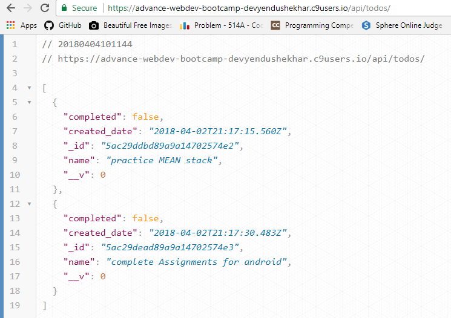
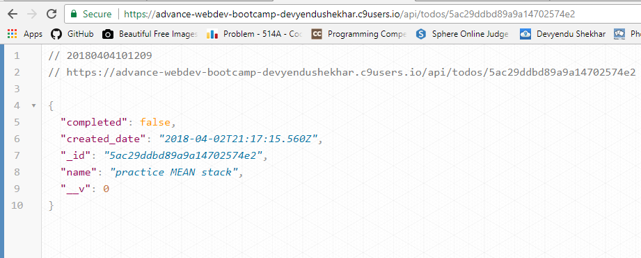

# My first Single Page Application - Todo-list( with CRUD ability )

### created on AWS - c9 platform 

## Routes

> /  - ( root route displays the todo list as shown in the project screenshot)

> /api/todos - ( the given route shows data in mongodb database in json format)

> /api/todos/ - ( it handles get and post requests )

> /api/todos/:todo_id - ( it handles put , delete and get requests on a particular todo with the help of todo_id  )

# My project Stack
> Nodejs , express , mongodb -( backend )

> HTML , CSS , JAVASCRIPT , jQuery -( frontend ) 

# Single Page Applications
> In single page applications , the request is made to server and the server responds back with data( which is displayed ) , and all this
   stuff happens without refreshing the page .
   
# Project Screenshots
 > Note(for newbies) : if you are cloning this project then please make sure that you are running it in node environment .
 
 
 
 
 
 

## Thanks for checking out this repository : )
