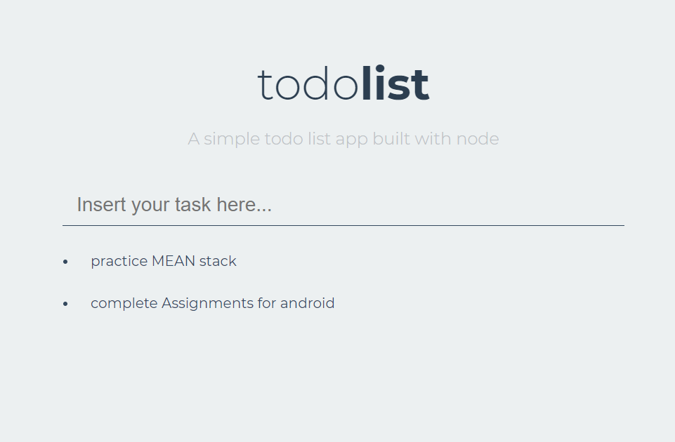

# My first Single Page Application - Todo-list

### created on AWS - c9 platform 

# My project Stack
> Nodejs , express , mongodb -( backend )

> HTML , CSS , JAVASCRIPT , jQuery -( frontend ) 

# Single Page Applications
> In single page applications , the request is made to server and the server responds back with data( which is displayed ) , and all this
   stuff happens without refreshing the page .
   
# Project Screenshot
 > Note(for newbies) : if you are cloning this project then please make sure that you are running it in node environment .
 
 
